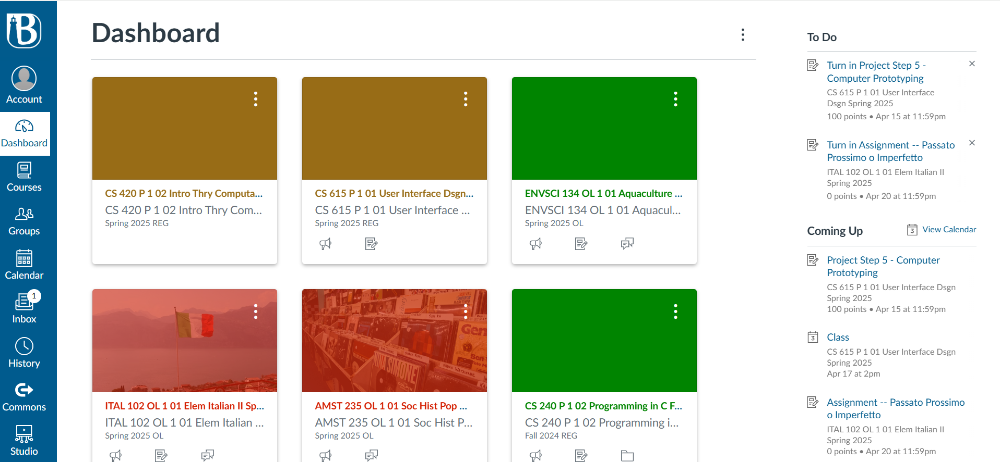

# EDU Horizon - Canvas-Inspired Learning Management System

EDU Horizon is a modern, responsive learning management system inspired by Canvas LMS. It provides a comprehensive set of features for both instructors and students to manage courses, assignments, quizzes, and communication.



## Features

- **Responsive Dashboard**: View all your courses, upcoming tasks, and important announcements
- **Course Management**: Easily navigate between courses and their content
- **Assignment & Quiz System**: Create, submit, and grade assignments and quizzes
- **Module Organization**: Organize course content into logical modules
- **Help Assistant**: Get assistance with course content using the built-in help assistant
- **Announcements**: Stay updated with course announcements
- **Grade Tracking**: View and manage grades for all assessments

## Technology Stack

- **Frontend**: React, TypeScript, Tailwind CSS, Shadcn UI
- **Backend**: Express.js, Node.js
- **State Management**: React Query
- **Routing**: Wouter
- **Form Handling**: React Hook Form
- **Validation**: Zod

## Getting Started

### Prerequisites

- Node.js (v18.0.0 or higher)
- npm (v8.0.0 or higher)
- Git

### Online Demo

Visit the application on Replit: [EDU Horizon Demo](https://eduhorizon.yourusername.repl.co)

### Installation for Windows

EDU Horizon includes Windows batch files to make installation and setup easy. Follow these simple steps:

#### Quick Setup (Recommended)

1. **Clone the repository**
   ```
   git clone https://github.com/yourusername/edu-horizon.git
   cd edu-horizon
   ```

2. **Run the Windows setup script**
   ```
   setup-windows.bat
   ```
   This script will:
   - Check for Node.js and npm
   - Install all project dependencies
   - Install cross-env for Windows compatibility
   - Create a default .env file

3. **Start the application**
   ```
   start-windows.bat
   ```
   
4. **Access the application**
   
   Open your browser and go to [http://localhost:5000](http://localhost:5000)

#### Manual Setup (Alternative)

If you prefer to set up manually:

1. **Clone the repository**
   ```
   git clone https://github.com/yourusername/edu-horizon.git
   cd edu-horizon
   ```

2. **Install dependencies**
   ```
   npm install
   ```

3. **Install cross-env (Required for Windows)**
   ```
   npm install cross-env --save-dev
   ```

4. **Create environment variables file**
   
   Create a `.env` file in the root directory:
   ```
   VITE_GEMINI_API_KEY=your_gemini_api_key_here
   ```
   
   Note: If you don't have a Gemini API key, the application will still work, but the AI assistant will use fallback responses.

5. **Start the development server**
   ```
   npx cross-env NODE_ENV=development tsx server/index.ts
   ```

6. **Access the application**
   
   Open your browser and go to [http://localhost:5000](http://localhost:5000)

### Troubleshooting Windows-Specific Issues

1. **Environment Variable Issues**
   - If you see errors related to `NODE_ENV`, ensure you've installed and configured cross-env correctly
   - Verify the scripts in package.json are using cross-env

2. **Port Conflicts**
   - If port 5000 is in use, you can change it in `server/index.ts`

3. **Node Version Issues**
   - Use [NVM for Windows](https://github.com/coreybutler/nvm-windows/releases) to install and use Node.js 18:
     ```
     nvm install 18
     nvm use 18
     ```

4. **Module Not Found Errors**
   - Try reinstalling node modules:
     ```
     rm -rf node_modules
     npm install
     ```

## Project Structure

- `/client` - Frontend React application
  - `/src/components` - Reusable UI components
  - `/src/layouts` - Page layout components
  - `/src/lib` - Utility functions and types
  - `/src/pages` - Page components
  - `/src/hooks` - Custom React hooks
- `/server` - Express.js backend
- `/shared` - Shared code (types, schemas)

## Environment Variables

- `VITE_GEMINI_API_KEY` - Google Gemini API key for AI assistant functionality

## Building for Production

To create a production build:

```
npm run build
npm run start
```

## License

This project is licensed under the MIT License - see the LICENSE file for details.

## Acknowledgements

- UI components from [Shadcn UI](https://ui.shadcn.com/)
- Icons from [Lucide React](https://lucide.dev/guide/packages/lucide-react)
- Inspired by Canvas LMS by Instructure